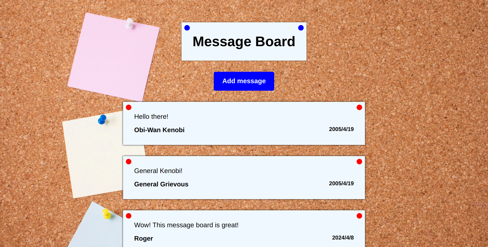
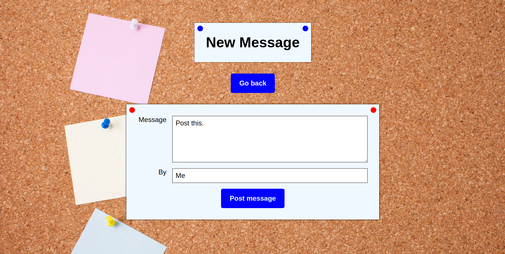

# Project - Message Board

This project is a web app that allows you view and post messages to a message board. It was created to put into practic using the Express framework, templating engines and routing and different requests.

[Checkout the live version here](https://rogereaux-message-board.adaptable.app/).

## Features

- Pages: The site is structured in different pages: Message Board and New Message.

  - Message Board displays all messages in the application
  - New Message displays a form that when filled and submitted, adds a new message to the message board

- Post Message: This button along with the form allows users to post new messages to the board.

- Responsive: The design of the website is inherently responsive, taking advantage of different viewing sizes to display the content in both aesthetically pleasing and effective ways

## Built using

- NodeJS
- Express
- Express Generator
- EJS

## Screenshots

Message Board



New Message



## Run locally

To setup and work on this project locally:

1. Clone the project

HTTP

```
$ git clone https://github.com/RogerEaux/message-board.git
```

SSH

```
$ git clone git@github.com:RogerEaux/message-board.git
```

2. Move to the cloned directory

```
cd message-board
```

3. Install dependencies

```
npm install
```

4. Start the dev server

```
npm run devstart
```
